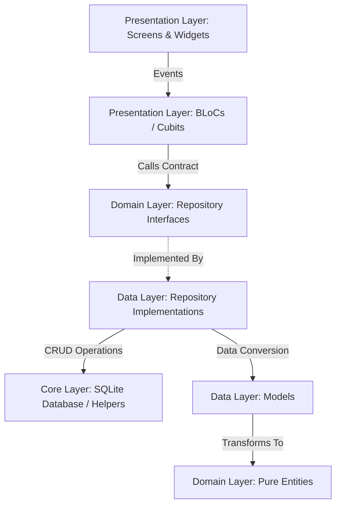
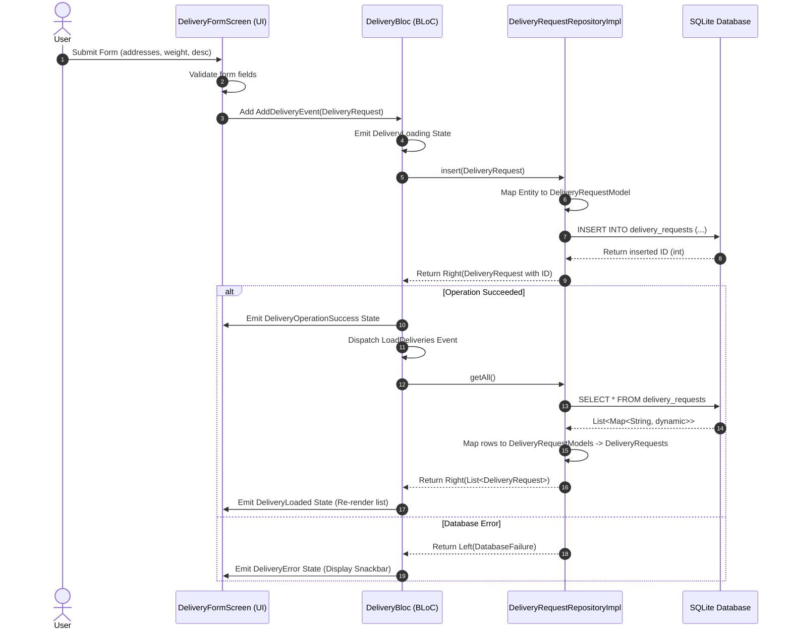

# Customer Delivery App - Architecture Documentation

This document describes the software architecture, design patterns, data flow, and components of the Customer Delivery App.

## 1. Architectural Patterns & Goals

The Customer Delivery App is built with **Clean Architecture** and **Feature-First Organization**. The primary goals are:

- **Separation of Concerns**: UI, business logic, persistence, and external libraries are decoupled.
- **Testability**: Core logic (BLoCs) and repositories can be unit tested without requiring a device or databases.
- **Predictable State Transitions**: BLoC pattern ensures that states flow in a uni-directional path.
- **Explicit Error Handling**: Leverages functional programming concepts via `fpdart`'s `Either` type to treat errors as first-class citizens.

---

## 2. Directory Layout & Layered Architecture

The app is organized into a clean layer hierarchy inside the [lib/](file:///Users/tiruskhamasi/Dev/code/mobile/customer_delivery_app/lib) directory:

### Layer Details

### 2.1 Domain Layer

The core layer containing business entities and repository definitions. This layer contains **no Flutter dependencies** and **no database dependencies**. It is written in pure Dart, ensuring high portability and ease of testing.

- **Entities**: Represents core business data structures.
    - [DeliveryRequest](file:///Users/tiruskhamasi/Dev/code/mobile/customer_delivery_app/lib/features/deliveries/domain/entity/delivery_request.dart): Represents a package delivery request (addresses, weight, status, description, code, etc.).
    - `DeliveryStatus`: Enum defining lifecycle states (`pending`, `inTransit`, `delivered`, `cancelled`). Contains rules like `canEdit` indicating whether a package's details can be updated or deleted (only allowed in the `pending` state).
    - `PackageWeightUnits`: Enum representing package weight units (`grams`, `kilograms`).
- **Repository Interface**:
    - [DeliveryRequestRepository](file:///Users/tiruskhamasi/Dev/code/mobile/customer_delivery_app/lib/features/deliveries/domain/repository/delivery_request_repository.dart): An abstract class defining CRUD operations, search, and status filtering interfaces.

### 2.2 Data Layer

Implements the interfaces defined in the domain layer and handles raw data formats, serialization, and storage queries.

- **Models**:
    - [DeliveryRequestModel](file:///Users/tiruskhamasi/Dev/code/mobile/customer_delivery_app/lib/features/deliveries/data/models/delivery_request_model.dart): Extension of/adaptation for the raw SQLite database representation. Implements `fromMap` and `toMap` serialization methods, and translates back and forth with the domain [DeliveryRequest](file:///Users/tiruskhamasi/Dev/code/mobile/customer_delivery_app/lib/features/deliveries/domain/entity/delivery_request.dart) entity.
- **Repository Implementation**:
    - [DeliveryRequestRepositoryImpl](file:///Users/tiruskhamasi/Dev/code/mobile/customer_delivery_app/lib/features/deliveries/data/repositories/delivery_request_repository_impl.dart): The concrete implementation of `DeliveryRequestRepository` that interacts with the SQLite database via [DatabaseHelper](file:///Users/tiruskhamasi/Dev/code/mobile/customer_delivery_app/lib/core/database/database_helper.dart). It catches low-level exceptions (e.g. `DatabaseException`) and returns them as functional failures (`Either<AppFailure, T>`).

### 2.3 Presentation Layer

Contains widgets, screens, and business logic components responsible for updating and rendering the UI.

- **State Management (BLoC / Cubit)**:
    - [DeliveryBloc](file:///Users/tiruskhamasi/Dev/code/mobile/customer_delivery_app/lib/features/deliveries/presentation/bloc/delivery_bloc.dart): Manages the state of deliveries. Listens to events like loading, searching, filtering, adding, editing, deleting, and updating statuses.
    - `ThemeCubit`: Cubit that manages the active theme mode (Light vs. Dark mode).
- **Screens**:
    - [DeliveryListScreen](file:///Users/tiruskhamasi/Dev/code/mobile/customer_delivery_app/lib/features/deliveries/presentation/screens/delivery_list_screen.dart): Lists all deliveries, features pull-to-refresh, status filters, and interactive search.
    - [DeliveryDetailScreen](file:///Users/tiruskhamasi/Dev/code/mobile/customer_delivery_app/lib/features/deliveries/presentation/screens/delivery_detail_screen.dart): Detailed view of a delivery, allowing status transitions and deletion (guarded by status restrictions).
    - [DeliveryFormScreen](file:///Users/tiruskhamasi/Dev/code/mobile/customer_delivery_app/lib/features/deliveries/presentation/screens/delivery_form_screen.dart): Handles creating new requests or editing pending ones. Includes form validation.
    - `SettingsScreen`: General settings page containing the theme toggle.
- **Widgets**:
    - `DeliveryCard`: Rendered card element in lists.
    - `FilterChipsRow`: Filter selector row for status filter chips.

### 2.4 Core Layer

Shared utilities, configurations, database infrastructure, and navigation setups.

- **Database**: [DatabaseHelper](file:///Users/tiruskhamasi/Dev/code/mobile/customer_delivery_app/lib/core/database/database_helper.dart) manages SQLite connection lifecycle, schema creation, database upgrades, and index management (`idx_delivery_status` and `idx_code`).
- **Failures**: [AppFailure](file:///Users/tiruskhamasi/Dev/code/mobile/customer_delivery_app/lib/core/error/failures.dart) defines sealed error subclasses like `DatabaseFailure`, `RecordNotFound`, `EditNotAllowed`, and `UnexpectedFailure`.
- **Navigation**: Configured route schema using `GoRouter` in [router.dart](file:///Users/tiruskhamasi/Dev/code/mobile/customer_delivery_app/lib/core/navigation/router.dart). Employs `AppShell` for bottom navigation structure.
- **Theming**: FlexColorScheme configurations supporting seamless Material 3 design and system/user dark/light modes.

---

## 3. Data Flow

The application follows a unidirectional data flow. Below is a detailed sequence representing how data flows during a user action (e.g., adding a delivery request):

---

## 4. Key Architectural & Design Decisions (Pros, Cons, & Alternates)

This section documents the technical decisions, why they were chosen, their tradeoffs, and alternatives that could have been selected.

### 4.1 Architectural Pattern: Feature-First Clean Architecture

The code is structured around functional features (e.g., `deliveries`) with clear sub-layers (`domain`, `data`, `presentation`).

- **Pros**:
    - **High Maintainability**: Modifying delivery features does not impact other parts of the application.
    - **Testability**: The `domain` layer has no dependencies on external packages, allowing 100% test coverage of business rules.
    - **Clear Boundaries**: Developers immediately know where to put new files based on their layer responsibility.
- **Cons**:
    - **Boilerplate Heavy**: Requires multiple files (Entity, Model, Repository Interface, Repository Impl, BLoC, Screens) even for simple data entities.
    - **Steep Learning Curve**: Developers must understand domain-driven and clean-architecture concepts before making changes.
- **Alternatives**:
    - _Layer-First Structure_: Organizing files by layer (e.g., `lib/views`, `lib/models`, `lib/controllers`). Good for small apps, but quickly becomes cluttered as the project grows.
    - _Simple MVC (Model-View-Controller)_: Direct database calls inside controllers. Fast prototyping but difficult to unit test and maintain long term.

### 4.2 State Management: `flutter_bloc`

Business logic and UI state are separated using the BLoC pattern.

- **Pros**:
    - **Unidirectional Data Flow**: State updates are predictable and follow an explicit Event -> Bloc -> State pipeline.
    - **Debounce & Concurrency Management**: Stream transformations (e.g., debouncing search inputs) are naturally handled via event transformers.
    - **Traceability**: A global `SimpleBlocObserver` monitors every event and state transition, simplifying debugging.
- **Cons**:
    - **Boilerplate**: Needs separate files for Events, States, and the BLoC controller class.
- **Alternatives**:
    - _ChangeNotifier / Provider_: Simpler to write and read, but harder to manage concurrency (like debouncing search events) and test predictably under complex conditions.
    - _Riverpod_: Extremely flexible and modern, but has a less rigid architecture structure than BLoC, which can lead to divergent state patterns in larger team settings.

### 4.3 Error Handling: Functional Programming with `fpdart` (`Either<AppFailure, T>`)

Instead of throwing exceptions, errors are treated as returnable values using functional programming patterns.

- **Pros**:
    - **Type Safety**: The compiler forces the BLoC/caller to handle the error path (`Left`) and the success path (`Right`). No more unhandled runtime exceptions.
    - **Domain-Specific Errors**: Errors are modeled as strongly-typed domain failures (`DatabaseFailure`, `RecordNotFound`, `EditNotAllowed`, etc.) instead of raw exceptions.
- **Cons**:
    - **Complex Syntax**: Code readability is slightly reduced for developers not familiar with functional programming concepts.
- **Alternatives**:
    - _Standard Exception Throwing_: Methods return `Future<T>` and throw exceptions on error. Requires manual, prone-to-omission `try-catch` blocks in presentation classes, leading to unexpected app crashes if a handler is missed.

### 4.4 Local Database: SQLite via `sqflite`

Relational database storage was selected for persistent offline-first state.

- **Pros**:
    - **Relational Power**: Supports standard SQL queries, relational joins, transactions, and performance indexes.
    - **Offline-First Stability**: Local database ensures the user's delivery catalog is fully accessible and editable without an active network.
- **Cons**:
    - **Mobile-Only Limitation**: Native `sqflite` does not support Flutter web target platforms natively without complex SQLite WebAssembly configurations.
    - **Manual Migrations**: Schema alterations require manual scripting inside database upgrade handlers.
- **Alternatives**:
    - _Hive / Isar (NoSQL)_: Very fast, supports web platforms out of the box, and doesn't require schema tables. However, it lacks robust relational index support and strict SQL constraints.
    - _Drift (Moor)_: A reactive SQLite wrapper. It reduces boilerplate with code generation, but increases dependency weight. Raw `sqflite` was preferred here for minimal dependencies and simple requirements.

### 4.5 Pre-condition Guards (Domain & Data Level)

Validation rules (e.g., restricting delivery updates/deletions only to the `pending` status) are enforced in the domain logic and verified in the repository.

- **Pros**:
    - **Single Source of Truth**: Business rules live inside the domain layer (`DeliveryStatus.canEdit`), making them easily reusable across forms, lists, and detail screens.
- **Cons**:
    - **Duplicate Work**: Checks occur both in the UI (to enable/disable buttons) and repository (to protect database integrity), requiring coordination.
- **Alternatives**:
    - _Database-only checks_: Relying on SQLite constraints. This provides poor user experience since failures happen late and are harder to parse into friendly UI messages.

---

## 5. Verification & Testing Stack

Quality assurance is performed at both the widget and unit level:

- **Unit Tests**:
    - `delivery_bloc_test.dart`: Validates business state transitions using the `bloc_test` library. It mocks repository calls to check loading, filtering, search debounce, and error handling states.
    - `delivery_request_model_test.dart`: Assures correct mapping from Map schema structures to Dart models.
- **Widget Tests**:
    - `delivery_list_screen_test.dart`: Validates list rendering, filter options interaction, search field response, and error state layouts.
    - `delivery_form_screen_test.dart`: Tests validation checks for weight limits, empty text inputs, and submission buttons.

---

## 6. Next Steps

The next steps include:

### 6.1 Implement Dependency Injection (DI)

- **Current State**: Repository classes are instantiated manually in `app.dart`.
- **Next Step**: Integrate `get_it` and `injectable` to register repositories and services as singletons.
- **Why**: Makes it easier to swap out mock implementations for UI testing and separates instantiation from configuration.

### 6.2 Set Up Remote Data Syncing (API Integration)

- **Current State**: All delivery requests exist purely in the local SQLite database.
- **Next Step**:
    1. Define remote repository sources (e.g., Http client calling a REST API).
    2. Add network detection helper class.
    3. Modify repository implementations to follow a caching strategy: Save data to remote server first, fall back to SQLite when offline, and synchronize pending changes upon regaining connectivity.

### 6.3 Schema Migrations Configuration

- **Current State**: Database initialization is locked at `version: 1`.
- **Next Step**: Configure the `onUpgrade` callback inside `DatabaseHelper` using migration scripts.
- **Why**: Protects user data from corruption when introducing new columns or changing existing table constraints during future app updates.

### 6.4 Status Notification Triggers

- **Current State**: Delivery status transitions occur silently in the database.
- **Next Step**: Integrate `flutter_local_notifications` to show push updates when status moves from `Pending` to `In Transit` or `Delivered`.
